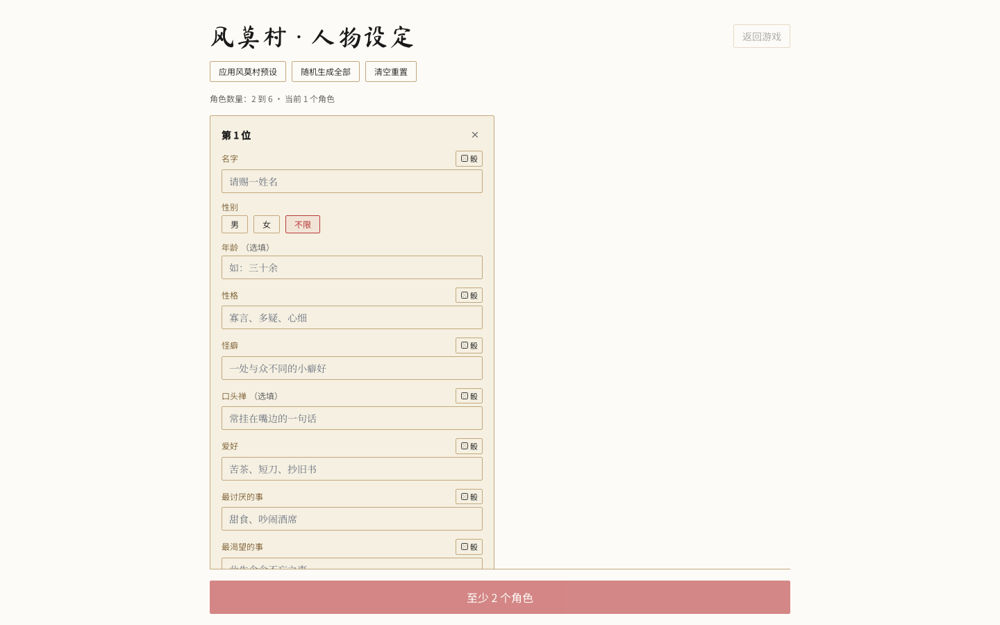
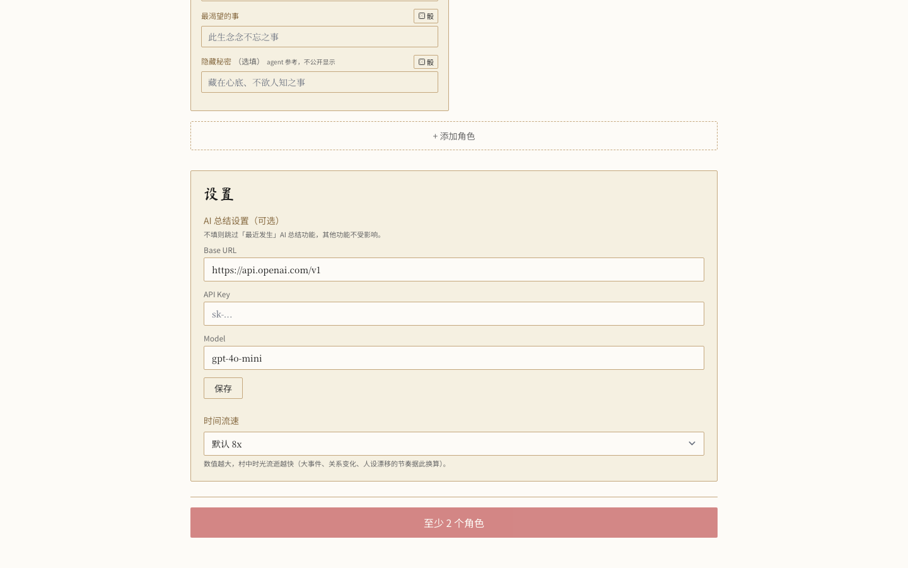
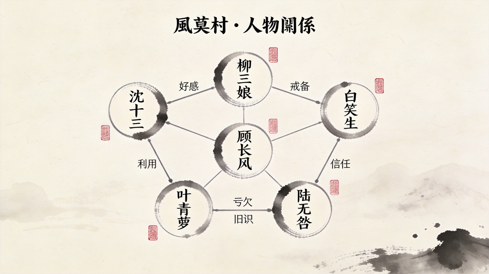

# 群像模拟器 / Ensemble Simulator

<!-- Badges: 发布到 GitHub 后请替换 your-org / repo-name -->


> **把你的 OC 放进一个世界里，看他们自己活起来。**  
> *Put your OCs into a world. Watch them live.*

**群像模拟器 / Ensemble Simulator** 是一个「**角色 × 世界观 × 自由互动**」的 Aime Skill / 本地应用框架。

你可以把自己的 OC（原创角色）、喜欢的角色，或任意自定义人设导入进来，让他们进入同一个世界，自由聊天、随机相遇、发展关系、触发事件，并逐渐长出属于他们自己的故事。

当前第一个世界观包是古风江湖 **「风莫村」**；而项目本身定位为可扩展的角色互动框架，支持后续扩展现代都市、奇幻大陆、宫廷权谋、异能学院等更多世界观。

如果用游戏类型来描述，它更像一款 **AI 驱动的文字模拟游戏**：你设定角色，世界自动运转，你只需要看故事发生。它有一点视觉小说（Visual Novel）的味道，但不是传统 VN 那种「玩家选择选项 → 推进固定剧情」的模式；在这里，剧情由角色们自己在世界中互动、生长和偏移，你更像是一个旁观者、记录者，偶尔才伸手干预。

*An AI-powered text simulation game: set the characters, let the world run, and watch the story happen.*

---

## 预览 / Preview

> 以下为项目真实截图（优先展示），以及补充的概念图。

### 真实截图 / Real Screenshots

<p align="center">
  
</p>

<p align="center">
  
  
</p>

### 概念图 / Concept Art

<p align="center">
  
</p>

---

## 为什么做这个项目？ / Why this project?

很多 AI 角色产品的核心体验是 **一对一聊天**：你说一句，角色回一句，剧情依赖你不断推进。

风莫村想做的是另一种体验：

### 1. 你的角色，你的故事

你可以导入自己的 OC、喜欢的角色，或自定义角色卡。系统会让他们在同一个世界中相遇、聊天、试探、冲突、靠近或疏远。

*Your characters are not waiting in separate chat boxes. They are living in the same world.*

### 2. 世界观不是背景板，而是互动容器

角色不会孤立存在于一个空白 Prompt 里。他们会受到地点、事件、关系、时间线和世界规则影响。

当前世界观是古风江湖村落「风莫村」；未来可以扩展到更多世界包。

*The world is not decoration. It is the stage, memory, and rule system for character interaction.*

### 3. 纯观察体验，挂机也能看戏

你可以随时介入，但不需要一直操作。核心体验是：启动世界，然后看角色自己聊天、结盟、误会、暗生情愫、产生冲突，观察关系如何变化。

*Start the simulation, then watch relationships and stories emerge.*

### 4. 零门槛上手，本地优先

不填 API Key 也可以启动体验。LLM 能力是增强项，不是必选项。角色数据和世界状态默认保存在本地，更适合 OC、私设和个人创作场景。

*No API key required to start. Local-first by default.*

---

## 功能特性 / Features

- 🧑‍🎨 **导入你的 OC** — 支持自定义原创角色、喜欢的角色、人设模板或预设角色。
- 🌍 **世界观驱动互动** — 角色会在同一个世界中行动，而不是各自待在独立聊天框里。
- 💬 **多 Agent 自主对话** — 角色可以主动发起对话，不需要用户每一步手动推进。
- 🎲 **随机相遇与剧情火花** — 世界会制造偶遇、闲谈、误会、冲突和关系变化。
- ❤️ **关系值演算** — 记录角色之间的亲近、疏离、信任、敌意、好奇等动态变化。
- 🌀 **人设漂移** — 角色会在长期互动和重大事件影响下发生细微变化。
- 🕰️ **大事件时间线** — 当前「风莫村」内置关键事件，用于推动群像剧情发展。
- 🧩 **世界观包架构** — 风莫村只是第一个世界，框架支持后续扩展更多世界观。
- 🏠 **完全本地运行** — 数据不上云，更适合私密 OC、私设和个人创作。
- 🔑 **LLM 可选配置** — 不配置 API Key 也能玩；配置后可开启更丰富的 AI 总结和关系分析。
- ⏩ **时间流速可调** — 支持 4x / 8x / 16x / 60x 等不同节奏。

---

## 快速开始 / Quick Start

```bash
# 1. 安装依赖
npm install

# 2. 启动本地应用
npm run dev

# 3. 打开终端中显示的本地地址
```

启动后：

1. 选择 **Fengmo Village / 风莫村** 世界观。
2. 使用 6 位预设角色，或导入 / 创建自己的 OC。
3. 开始模拟，然后观察角色自由互动。

> 如果你的项目最终使用 `pnpm`、`yarn` 或 Aime Skill 的专用启动方式，可以在发布前替换这里的命令。

---

## 它是怎么工作的？ / How it works

风莫村使用一个轻量级 **多 Agent 自主对话系统**。

整体流程可以理解为：

```text
角色读取世界状态 → 判断是否互动 → 发起聊天 / 回应事件 → 更新关系值 → 影响后续行为
```

每个角色都拥有：

- **人设 Persona**：性格、说话方式、目标、边界、秘密。
- **状态 State**：当前经历、情绪、所处位置、近期互动。
- **关系 Relationships**：对其他角色的动态关系值。
- **世界感知 World Awareness**：当前地点、活跃事件、背景规则。

世界引擎负责：

- 安排角色何时相遇；
- 决定谁和谁对话；
- 触发当前时间线事件；
- 根据互动结果调整关系；
- 将小对话累积成长期剧情。

*In short: every character is an agent, and the world keeps feeding context back into future interactions.*

---

## 自定义你的角色 / Customize your characters

你可以替换预设角色，也可以导入自己的 OC。

一个角色档案可以包含：

```ts
type CharacterProfile = {
  name: string;
  title?: string;
  age?: string;
  personality: string;
  speakingStyle: string;
  background: string;
  goals?: string[];
  secrets?: string[];
  likes?: string[];
  dislikes?: string[];
  relationships?: Record<string, number>;
};
```

示例：

```json
{
  "name": "林照",
  "title": "游方铸剑师",
  "personality": "寡言、敏锐、慢热，但一旦信任就极重承诺",
  "speakingStyle": "短句，偶尔冷幽默，不爱解释",
  "background": "因一把断裂的旧剑来到风莫村，似乎在寻找它曾经的主人。",
  "goals": ["找到断剑的主人", "避开旧日仇家"],
  "secrets": ["他知道当年村中大火的部分真相"],
  "likes": ["雨夜", "旧兵器", "守信的人"],
  "dislikes": ["官府", "空话", "试探"]
}
```

写角色时建议：

- 不只写性格，也写 **欲望和目标**；
- 给角色一两个 **秘密或隐痛**，更容易产生张力；
- 明确 **说话风格**，角色会更有辨识度；
- 不要让所有关系都从 0 开始，预设一点误会、旧识或偏见会更有戏。

---

## 世界观包 / World Packs

### 当前可用：风莫村 / Fengmo Village

一个古风江湖村落。外来者、医者、剑客、商人、旧案、隐瞒身份的人，在同一个村子里相遇。

当前内容包括：

- 6 位预设角色；
- 古风 / 江湖 / 村落世界观；
- 内置大事件时间线；
- 关系值模拟；
- 自主角色对话；
- 本地优先运行体验。

### 未来可能扩展 / Coming later

框架设计上支持更多世界观包，例如：

- 🏙️ 现代都市 / Modern City
- 🏰 宫廷权谋 / Palace Intrigue
- 🧙 奇幻大陆 / Fantasy Realm
- 🚀 太空殖民地 / Space Colony
- 🏫 异能学院 / Supernatural School

每个世界观包都可以定义自己的：

- 地点；
- 社会规则；
- 默认角色；
- 大事件时间线；
- 关系机制；
- 剧情触发条件。

---

## 技术栈与来源说明 / Tech Stack & Credits

本项目基于 [AI Town](https://github.com/a16z-infra/ai-town) 开源项目改造。

AI Town 是一个用于构建可定制 AI 虚拟小镇的开源 starter kit。风莫村保留了其「多角色在同一世界中生活、聊天、互动」的核心思路，并将体验方向从像素地图模拟改造成更适合中文 OC / 群像创作的 **纯文字世界观互动框架**。

### 基础技术栈

- **React** — 前端交互界面
- **TypeScript** — 类型安全的应用逻辑
- **Convex** — 后端状态、实时数据与表结构管理
- **Multi-Agent Simulation** — 多角色自主行为与对话调度
- **Relationship Engine** — 关系值、亲疏变化与互动后果
- **Persona Drift System** — 基于长期互动的人设漂移

### 相比 AI Town 的主要改动

- **移除 Pixi.js 地图 / 精灵 / WebGL**  
  从像素地图和角色精灵表现，改为更轻量的 **纯文字古风卷轴 UI**，重点突出角色对话、世界事件和群像叙事。

- **新增大事件系统**  
  新增 `worldEvents` 表和时间线事件触发机制，让世界不只是等待角色闲聊，而是会按阶段发生影响全员的关键事件。

- **新增角色编辑页**  
  支持首次启动进入角色配置流程，可自定义 OC，也可从预设角色库中选择和调整角色。

- **新增关系值 LLM 打分**  
  每现实 8 小时对角色关系进行一次 LLM 辅助评估，用于更新角色之间的亲近、信任、敌意、好奇等关系变化。

- **新增人设漂移机制**  
  每现实 24 小时根据长期互动和事件影响，对角色状态与人设倾向进行总结和轻微漂移，让角色不是静态卡片。

- **新增 LLM 可选配置**  
  支持 OpenAI-compatible 配置；不填写 API Key 时会跳过 AI 总结能力，保留基础本地体验。

- **Token 优化**  
  对话历史截断、memory 上限收紧，并加入重要度规则预筛，减少不必要的上下文消耗。

- **时间流速可调**  
  支持 4x / 8x / 16x / 60x 等模拟速度，适配慢速观察和快速推进两种玩法。

---

## Aime Skill 市场说明 / For Aime Skill Market

风莫村也可以作为 Aime Skill 发布。

推荐简介：

> 把你的 OC 放进一个会自己运转的世界。风莫村是「角色 × 世界观 × 自由互动」框架下的第一个世界观 Skill：导入角色，启动模拟，看他们自己聊天、相遇、发展关系和剧情。

Short English description:

> Put your OCs into a living world and watch them interact. Fengmo Village is the first world pack in a Character × World × Free Interaction framework.

推荐标签：

```text
OC, AI Characters, Roleplay, Multi-Agent, Simulation, Local-First, Worldbuilding, Storytelling, Aime Skill, 中文角色扮演
```

---

## 路线图 / Roadmap

- [ ] 优化角色导入与角色编辑体验
- [ ] 增加角色卡模板，降低 OC 创建门槛
- [ ] 将关系值从单一数值扩展为多维关系
- [ ] 增加更多自主事件触发条件
- [ ] 支持完整世界存档导入 / 导出
- [ ] 增加更多世界观包：现代都市、奇幻大陆、宫廷权谋等
- [ ] 优化未配置 LLM 时的基础互动体验
- [ ] 增加更多 OpenAI-compatible LLM 配置示例
- [ ] 完成 Aime Skill 市场打包与一键安装体验

---

## 参与贡献 / Contributing

欢迎贡献，尤其是以下方向：

- 新世界观包；
- 角色卡格式；
- 关系值演算机制；
- 本地优先体验优化；
- 非 LLM 模式下的互动逻辑；
- 文档、截图、示例角色和教程。

贡献流程：

1. Fork 本仓库；
2. 创建你的功能分支；
3. 提交修改；
4. 发起 Pull Request，并说明改动内容；
5. 如果涉及 UI 或世界观内容，建议附上截图或录屏。

如果你想贡献新的世界观包，请尽量包含：

- 世界观一句话概念；
- 地点列表；
- 默认角色；
- 大事件时间线；
- 互动规则；
- 示例截图或运行记录。

---

## 许可证 / License

MIT License.

本项目基于 AI Town 开源项目改造，原项目同样采用 MIT License。你可以自由使用、修改和二次开发本项目。详情请查看 [`LICENSE`](./LICENSE)。

---

## 一句话总结 / One-line summary

**把你的角色放进世界里，看他们自己活起来。**  
**Put your OCs into a world. Watch them live.**
